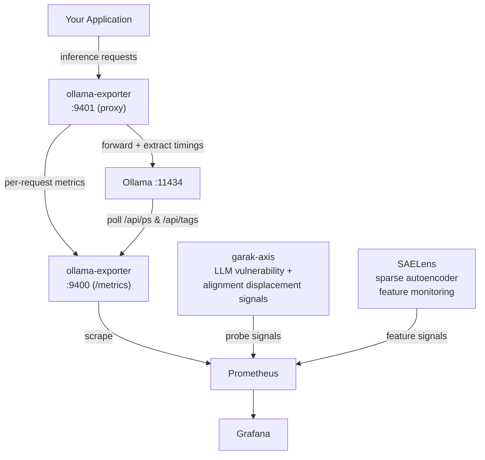

# ollama-exporter

A production-grade Go Prometheus exporter for [Ollama](https://ollama.com) LLM inference.

Exposes per-request inference metrics, model lifecycle events, and derived AI-specific
signals that no existing exporter provides — built in pure Go with zero unnecessary
dependencies, following node_exporter/blackbox_exporter conventions.

## Why This Exists

Ollama has no native `/metrics` endpoint. Existing community exporters are Python proxies
or minimal Go stubs. None expose the semantic layer that matters for serious LLM
observability: tokens-per-second by quantization level, KV cache pressure inference,
model load/eviction event tracking, or in-flight concurrency.

This exporter was designed from first principles for a local AI safety research stack,
where inference signals need to correlate with behavioral probe results (Garak, SAE
interpretability) in the same Grafana instance.

## Design

### Two Collection Modes

**Poller** scrapes `/api/ps` and `/api/tags` on a configurable interval. Provides
model inventory and VRAM state. Always-on baseline — survives proxy failures.

**Proxy** sits transparently in front of Ollama. Your application points at the
exporter instead of Ollama directly. The exporter intercepts request/response pairs,
extracts Ollama's timing fields from the JSON body, records histogram observations,
then forwards the original response downstream. Latency overhead: microseconds.

If proxy health check fails, the exporter degrades gracefully to poller-only mode.
Prometheus continues receiving model state metrics without interruption.

### Metric Design

- Namespace: `ollama_`
- Quantization parsed from model tag into discrete label: `quant="q4_0"`
- Model family parsed into label: `family="llama3"`
- Histograms for latency (not summaries)
- Derived metrics (TPS, KV pressure) computed at scrape time
- Prompt text never appears in labels — no cardinality explosions

### Key Metrics

| Metric | Type | Description |
|---|---|---|
| `ollama_up` | Gauge | Ollama API health (1=up, 0=down) |
| `ollama_model_loaded` | Gauge | 1 if model currently in VRAM, 0 after unload |
| `ollama_model_vram_bytes` | Gauge | VRAM consumed per loaded model; resets to 0 on unload |
| `ollama_model_load_total` | Counter | Cumulative load events per model (including startup) |
| `ollama_model_unload_total` | Counter | Cumulative eviction events per model |
| `ollama_model_load_events_total` | Counter | Load transitions observed after startup (excludes models present at launch) |
| `ollama_model_unload_events_total` | Counter | Unload transitions observed after startup |
| `ollama_model_load_duration_seconds` | Histogram | Model load time from proxied response `load_duration` field |
| `ollama_request_duration_seconds` | Histogram | End-to-end request latency |
| `ollama_load_duration_seconds` | Histogram | Per-request model load time (model/family/quant labels) |
| `ollama_prompt_eval_duration_seconds` | Histogram | Prompt evaluation time |
| `ollama_eval_duration_seconds` | Histogram | Token generation time |
| `ollama_tokens_per_second` | Gauge | Derived: eval_count / eval_duration |
| `ollama_prompt_tokens_per_second` | Gauge | Derived: prompt_eval_count / prompt_eval_duration |
| `ollama_requests_in_flight` | Gauge | Current concurrent requests (proxy mode) |
| `ollama_requests_total` | Counter | Total requests by model and endpoint |
| `ollama_kv_cache_pressure_ratio` | Gauge | Derived: prompt eval duration / token ratio trend |

#### GPU Metrics (AMD, amdgpu driver)

| Metric | Type | Description |
|---|---|---|
| `ollama_gpu_utilization_percent` | Gauge | GPU utilization 0–100, from `gpu_busy_percent` in sysfs |
| `ollama_gpu_temperature_celsius` | Gauge | GPU temperature in °C, from hwmon `temp1_input` (millidegrees ÷ 1000) |
| `ollama_gpu_vram_used_bytes` | Gauge | VRAM in use, from `mem_info_vram_used` |
| `ollama_gpu_vram_total_bytes` | Gauge | Total VRAM, from `mem_info_vram_total` (cached at startup) |
| `ollama_gpu_power_watts` | Gauge | Power draw in watts, from hwmon `power1_average` or `power1_input` (microwatts ÷ 1 000 000) |
| `ollama_gpu_clock_mhz{type="gpu"}` | Gauge | Active GPU core clock in MHz, from `pp_dpm_sclk` |
| `ollama_gpu_clock_mhz{type="memory"}` | Gauge | Active memory clock in MHz, from `pp_dpm_mclk` |

All GPU metrics carry `gpu` (card index: "0", "1", …) and `name` (product name or "amdgpu_cardN") labels.

Full reference: [docs/metrics.md](docs/metrics.md)

## Quick Start

### Binary

```bash
go install github.com/maravexa/ollama-exporter/cmd/exporter@latest
ollama-exporter --ollama-url http://localhost:11434 --listen :9400
```

### Docker

Linux (host.docker.internal requires --add-host flag):

```bash
docker run -d \
  --add-host=host.docker.internal:host-gateway \
  -e OLLAMA_URL=http://host.docker.internal:11434 \
  -p 9400:9400 -p 9401:9401 \
  ghcr.io/maravexa/ollama-exporter:latest
```

macOS / Windows (host.docker.internal resolves automatically):

```bash
docker run -d \
  -e OLLAMA_URL=http://host.docker.internal:11434 \
  -p 9400:9400 -p 9401:9401 \
  ghcr.io/maravexa/ollama-exporter:latest
```

Or use your host's LAN IP directly (works everywhere):

```bash
docker run -d \
  -e OLLAMA_URL=http://192.168.1.x:11434 \
  -p 9400:9400 -p 9401:9401 \
  ghcr.io/maravexa/ollama-exporter:latest
```

Port reference:
- 9400 — Prometheus metrics endpoint (`/metrics`)
- 9401 — Transparent proxy (point your Ollama client here)

### Docker Compose (full PLG stack)

```bash
docker compose up -d
```

Includes: ollama-exporter, Prometheus, Grafana with pre-built dashboard.

## Configuration

```yaml
# ollama-exporter.yml
ollama_url: "http://localhost:11434"
listen_addr: ":9400"
poll_interval: "15s"

proxy:
  enabled: true
  # Your app points here instead of Ollama directly
  listen_addr: ":9401"
  # Paths forwarded normally but excluded from metric recording.
  # Prevents internal polling calls from inflating inference histograms.
  exclude_paths:
    - "/"
    - "/api/ps"
    - "/api/tags"
    - "/api/show"
    - "/api/version"

gpu:
  enabled: true
  # poll_interval: "5s"           # separate GPU poll interval; inherits poll_interval if unset
  # sysfs_base: /sys/class/drm   # override for testing

log_level: "info"  # debug | info | warn | error
```

All fields overridable via environment variables: `OLLAMA_URL`, `LISTEN_ADDR`, etc.

## Prometheus Scrape Config

```yaml
scrape_configs:
  - job_name: 'ollama'
    static_configs:
      - targets: ['localhost:9400']
```

## GPU Metrics

The exporter collects AMD GPU hardware metrics directly from the Linux kernel's
sysfs interface exposed by the **amdgpu** driver. **No ROCm installation is
required** — `rocm-smi`, `amd-smi`, and all ROCm userspace packages are
completely absent from the dependency tree.

### How It Works

On startup the exporter scans `/sys/class/drm/card*` for directories whose
`device/vendor` file contains AMD's vendor ID (`0x1002`). For each discovered
GPU it resolves the hwmon subdirectory once (the kernel-assigned hwmon index
varies across boots) and caches the total VRAM. Subsequent poll cycles read the
remaining sysfs files and emit Prometheus gauges.

Each sysfs read is independently failable: if a file is absent or contains
unexpected content (e.g. `gpu_busy_percent` returns `ENOTSUP` on some older
cards), that metric is skipped for the current cycle and a debug-level log line
is emitted. All other metrics continue unaffected.

### Access Requirements

All paths under `/sys/class/drm/` are world-readable by default on Linux —
no special capabilities or sudo are needed to run the exporter.

### Disabling GPU Collection

Set `gpu.enabled: false` in `ollama-exporter.yml` to disable GPU metric collection
entirely. The exporter also disables GPU metrics automatically (with a warning)
when no AMD GPUs are found at startup.

## Security Properties

- Pure Go — no CGo, statically linkable
- Dependencies: stdlib + `prometheus/client_golang` only
- Dockerfile: distroless/static base, runs as uid 65534 (nobody)
- No dynamic code loading, no eval, no reflection-based config

## Compatibility

Tested against Ollama 0.3.x and 0.4.x on:
- Linux (amd64, arm64)
- Local inference: AMD RX 6700 XT (ROCm 6.3), NVIDIA (CUDA)

## Architecture Context

This exporter is part of a local AI safety observability stack:



Inference metrics correlate with behavioral probe results in a single Grafana instance.

## Development

[](https://github.com/maravexa/ollama-exporter/actions/workflows/ci.yaml)

CI runs automatically on all PRs and pushes to main (lint, test with race detector,
govulncheck reachability analysis, and cross-platform build verification).

Run the full CI suite locally before pushing:

```bash
make ci
```

Run individual checks:

```bash
make lint       # golangci-lint
make test       # go test -race with coverage report
make vulncheck  # govulncheck reachability analysis
make fmt        # verify gofmt formatting (non-destructive)
make vet        # go vet
```

## License

MIT
